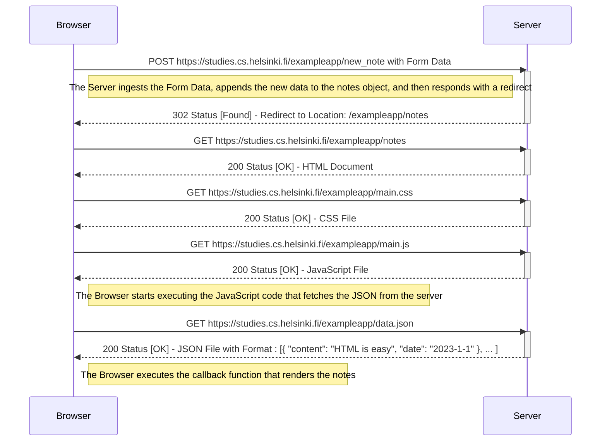

```mermaid
sequenceDiagram
participant b as Browser
participant s as Server

b->>s: POST https://studies.cs.helsinki.fi/exampleapp/new_note with Form Data
activate s
Note right of b: The Server ingests the Form Data, appends the new data to the notes object, and then responds with a redirect
s-->>b: 302 Status [Found] - Redirect to Location: /exampleapp/notes
deactivate s

b->>s: GET https://studies.cs.helsinki.fi/exampleapp/notes
activate s
s-->>b: 200 Status [OK] - HTML Document 
deactivate s

b->>s: GET https://studies.cs.helsinki.fi/exampleapp/main.css
activate s
s-->>b: 200 Status [OK] - CSS File
deactivate s

b->>s: GET https://studies.cs.helsinki.fi/exampleapp/main.js
activate s
s-->>b: 200 Status [OK] - JavaScript File
deactivate s

Note right of b: The Browser starts executing the JavaScript code that fetches the JSON from the server

b->>s: GET https://studies.cs.helsinki.fi/exampleapp/data.json
activate s
s-->>b: 200 Status [OK] - JSON File with Format : [{ "content": "HTML is easy", "date": "2023-1-1" }, ... ]
deactivate s

Note right of b: The Browser executes the callback function that renders the notes
```
