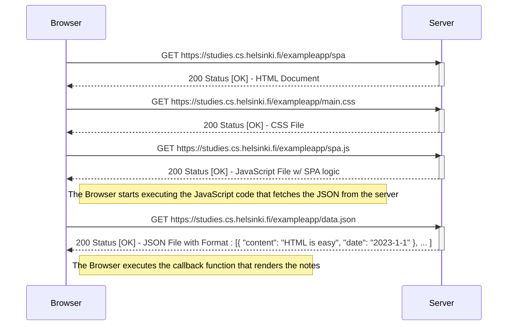

```mermaid
sequenceDiagram
participant b as Browser
participant s as Server

b->>s: GET https://studies.cs.helsinki.fi/exampleapp/spa
activate s
s-->>b: 200 Status [OK] - HTML Document
deactivate s

b->>s: GET https://studies.cs.helsinki.fi/exampleapp/main.css
activate s
s-->>b: 200 Status [OK] - CSS File
deactivate s

b->>s: GET https://studies.cs.helsinki.fi/exampleapp/spa.js
activate s
s-->>b: 200 Status [OK] - JavaScript File w/ SPA logic
deactivate s

Note right of b: The Browser starts executing the JavaScript code that fetches the JSON from the server

b->>s: GET https://studies.cs.helsinki.fi/exampleapp/data.json
activate s
s-->>b: 200 Status [OK] - JSON File with Format : [{ "content": "HTML is easy", "date": "2023-1-1" }, ... ]
deactivate s

Note right of b: The Browser executes the callback function that renders the notes
```
