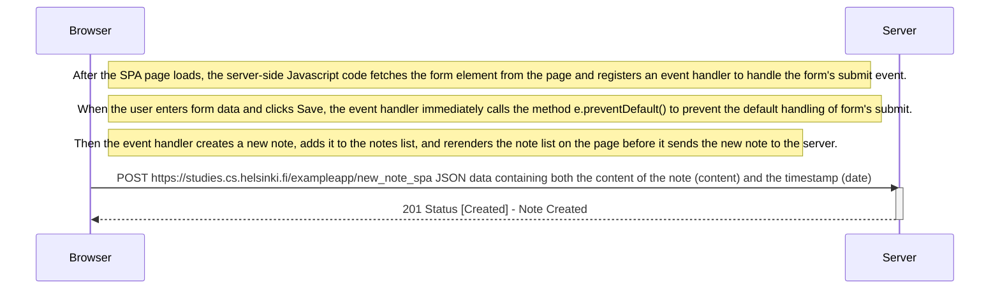

```mermaid
sequenceDiagram
participant b as Browser
participant s as Server

Note right of b: After the SPA page loads, the server-side Javascript code fetches the form element from the page and registers an event handler to handle the form's submit event.
Note right of b: When the user enters form data and clicks Save, the event handler immediately calls the method e.preventDefault() to prevent the default handling of form's submit.
Note right of b: Then the event handler creates a new note, adds it to the notes list, and rerenders the note list on the page before it sends the new note to the server.
b->>s: POST https://studies.cs.helsinki.fi/exampleapp/new_note_spa JSON data containing both the content of the note (content) and the timestamp (date)
activate s
s-->>b: 201 Status [Created] - Note Created
deactivate s

```
